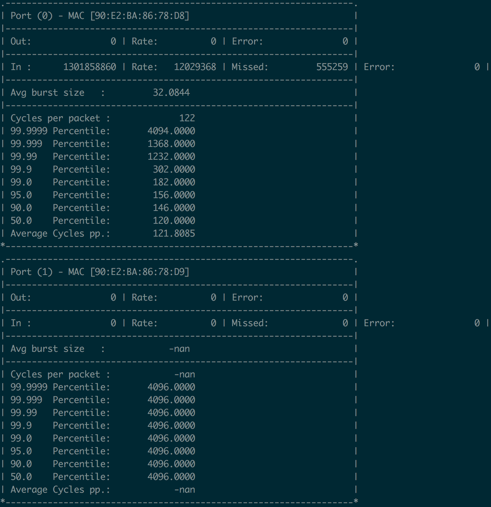

# Agg-Evict

## Introduction

Network measurement plays an important role for many network functions such as detecting network anomalies and identifying big flows. However, most existing measurement solutions fail to achieve high performance in software as they often incorporate heavy computations and a large number of random memory accesses. We present Agg-Evict, a generic framework for accelerating network measurement in software. Agg-Evict aggregates the incoming packets on the same flows and sends them as a batch, reducing the number of computations and random memory accesses in the subsequent measurement solutions. We perform extensive experiments on top of DPDK with 10G NIC and observe that almost all the tested measurement solutions under Agg-Evict can achieve 14.88 Mpps throughput and see up to 5.7× lower average processing latency per packet.

## About this repo

This repo contains the source code and detailed descriptions of how to replicate our results. 
Folder **mypktgen** contains the code for sending packets. 
Folder **simdbatch** contains the code for receiving packets. 
Folder **traces** contains the data packet traces or its generating method. 

## System requirement

We use two Ubuntu servers that run on Intel Xeon E5-2650 v4 processors. The processor has 12 cores, 256KB L2 cache, and 30MB shared L3 cache. The servers are connected by two Intel 82599ES 10G NICs and a switch set to L2 forwarding mode. We use DPDK-16.07.2, a set of data plane libraries for packet processing, to send and receive packets from the NIC.


## How to specify parameters

### Sender side

- Set src MAC address in mypktgen/tload.c (line 98-103 and 161-166): pm->tcp.eth.s_addr.addr_bytes[0~5]; 
- Set dst MAC address in mypktgen/tload.c (line 108-113 and 171-176): pm->tcp.eth.d_addr.addr_bytes[0~5]; 	


### Receiver side

- Set the batch size when receiving packets from NIC in pktreceiver/src/common.h: **MAX\_PKT\_BURST**
- Set the batch size when sending packets to measurement algorithms in pktreceiver/src/common.h: **MAX\_RX\_BURST**
- Set the KV number of Agg-Evict for all the experiments in pktreceiver/src/modules/simdbatch/common.h: **SIMD\_ROW\_NUM**
- Set using GRR or LRU for all the experiments except for varying key size (flow ID) in pktreceiver/src/modules/simdbatch/common.h: define **GRR\_ALL** or **LRU\_ALL**
- Set using GRR or LRU for varying key size (flow ID) in pktreceiver/src/modules/simdbatch/vary-keysize/common.h: define **GRR** or **LRU**
- Set different key sizes (flow IDs) in pktreceiver/src/modules/simdbatch/vary-keysize/common.h: define **SIP** or **DIP** or **SD_PAIR** or **FOUR_TUPLE** or **FIVE_TUPLE**


## How to build 
Note that on both sender and receiver sides, you has corresponding kernel driver been load and bind to one network port of a NIC and set the **RTE_SDK** environmental variable of DPDK. 
We provide our script to load and bind driver in prepare-dpdk.sh. 
You can set corresponding network port address in it, put it into the dpdk fold, and run 
```
sudo expect -f prepare-dpdk.sh
```


### Sender side
```
cd mypktgen
sudo -E make
```


### Receiver side
```
cd pktreceiver
sudo -E make
```


## How to run the experiments

Make sure sender can directly send packet to receiver by specify the MAC address of receiver. 
Make sure sender and receiver can communicate with each other through TCP. 
Sender will automatically adjust the sending rate to reach the maximum value with no packet loss, according to the packet loss feedback from the receiver through TCP. 

### Sender side

```
sudo ./build/app/pkt-sender-auto -l 0-2 -n 2 -- -t ../traces/traffic_sender.dat -s 5000 -L 64 -T 66

```	
where -l and -n are set according to your cpu infomation (check [dpdk doc](https://dpdk.org/doc/guides/testpmd_app_ug/run_app.html)), -t is the traces that you want to send (you can also specify the synthetic zipf traces), -s is the initial sending rate that you set (actually, it has no impact on our experiments), -L is packet size, and -T is the times that you send the traces. 


### Receiver side
You should set the variable **sender_ip** in pktreceiver/src/main.c to the ip address of sender server (eg, 10.243.38.89).

```
sudo ./build/app/l2fwd -l 0-6 -n 2 -- /home/yangz/measure-pkt/experiments/simdbatch/cmsketch.yaml
```
where the file behind "--" could be any file in the fold of pktreceiver/experiments/simdbatch/: 

- cmsketch.yaml: testing pure CM sketch;
- cmsketchsimd.yaml: testing CM sketch with Agg-Evict;
- flowradar.yaml, flowradarsimd.yaml, fmsketch.yaml, fmsketchsimd.yaml, linearcounting.yaml, linearcountingsimd.yaml, mrac.yaml, mracsimd.yaml, revsketch.yaml, revsketchsimd.yaml, spacesaving.yaml, spacesavingsimd.yaml, twolevel.yaml, twolevelsimd.yaml, univmon.yaml, and univmonsimd.yaml are similar;
- flowradarv.yaml: testing pure FlowRadar under different key sizes (flow IDs); 
- flowradarsimdv.yaml: testing FlowRadar with Agg-Evict under different key sizes (flow IDs);  
- flowradarnosimd.yaml: testing FlowRadar with Agg-Evict without the assistance of SIMD instructions;

After several seconds that both sides are running, the sender and receiver begin to communicate with each other to automatically and dichotomously adjust sending rate to reach the maximum value with no packet losses. 
Then, the receiver side will continuously print the packet processing information including packet rate (ie, throughput), latencies (average and 99th percentile). 
Here is the example: 

In this figure, the packet rate is 12029368pps, the average latency is 121.8085/2.2 = 55.4ns (our cpu is at 2.2Ghz), and the 99th percentile latency is 182.0000/2.2 = 82.72ns.

Finally, after several minutes, the packet rate of receiver side will become very stable, then we can get the maximum packet rate with no packet loss from the printed infomation in the receiver side. 
When the sender sends out the traffic trace -T times, the process at receiver side will be killed by itself, and the final latency information will be wrote into a file named **processinglatency.txt**. 


## Contact
If you have any questions, please contact zhou.yang@pku.edu.cn.


## Update of this opensource
This opensource will be maintained and updated at [https://github.com/zhouyangpkuer/Agg-Evict](https://github.com/zhouyangpkuer/Agg-Evict). 


